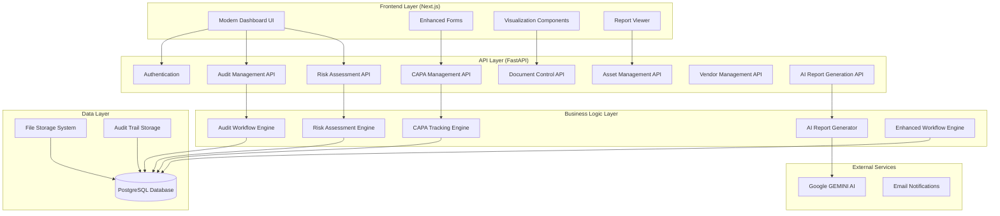

# Design Document

## Overview

This design document outlines the architecture and implementation approach for enhancing the existing audit management system to achieve full ISO compliance and implement comprehensive stakeholder-requested features. The design builds upon the current FastAPI backend with PostgreSQL database and Next.js frontend, extending it with new modules while maintaining backward compatibility.

## Architecture

### System Architecture Overview



### Database Architecture Extensions

The design extends the existing database schema with new tables while maintaining relationships with current entities:

```mermaid
erDiagram
    %% Existing Core Tables (Enhanced)
    audits ||--o{ audit_checklists : has
    audits ||--o{ audit_risks : has
    audits ||--o{ capa_items : generates
    
    %% New ISO Compliance Tables
    iso_frameworks {
        uuid id PK
        string name
        string version
        text description
        json clauses
        datetime created_at
    }
    
    audit_checklists {
        uuid id PK
        uuid audit_id FK
        uuid framework_id FK
        string clause_reference
        text description
        string compliance_status
        int compliance_score
        text notes
        datetime next_due_date
        datetime created_at
    }
    
    checklist_evidence {
        uuid id PK
        uuid checklist_id FK
        string file_name
        string file_url
        string file_hash
        text description
        datetime uploaded_at
    }
    
    %% Risk Management Tables
    risk_assessments {
        uuid id PK
        uuid audit_id FK
        uuid asset_id FK
        string risk_title
        text description
        int likelihood_score
        int impact_score
        int risk_rating
        string risk_category
        text mitigation_plan
        datetime next_review_date
        datetime created_at
    }
    
    risk_controls {
        uuid id PK
        uuid risk_id FK
        string control_reference
        text control_description
        string implementation_status
        datetime created_at
    }
    
    %% CAPA Enhancement Tables
    capa_items {
        uuid id PK
        uuid audit_id FK
        uuid finding_id FK
        uuid risk_id FK
        string capa_type
        text corrective_action
        text preventive_action
        text root_cause_analysis
        uuid assigned_to_id FK
        datetime due_date
        string status
        text verification_evidence
        datetime created_at
    }
    
    %% Document Control Tables
    document_repository {
        uuid id PK
        string document_name
        string document_type
        string version
        string file_url
        string file_hash
        uuid uploaded_by_id FK
        uuid approved_by_id FK
        datetime expiry_date
        string approval_status
        text change_history
        datetime created_at
    }
    
    document_tags {
        uuid id PK
        uuid document_id FK
        string tag_name
        datetime created_at
    }
    
    %% Asset Management Tables
    assets {
        uuid id PK
        string asset_name
        string asset_category
        decimal asset_value
        datetime procurement_date
        uuid owner_id FK
        uuid department_id FK
        string status
        datetime disposal_date
        decimal disposal_value
        datetime created_at
    }
    
    asset_assignments {
        uuid id PK
        uuid asset_id FK
        uuid user_id FK
        datetime assigned_date
        datetime returned_date
        text assignment_notes
        datetime created_at
    }
    
    %% Vendor Management Tables
    vendors {
        uuid id PK
        string vendor_name
        string contact_person
        string email
        string phone
        text address
        string risk_rating
        datetime created_at
    }
    
    vendor_evaluations {
        uuid id PK
        uuid vendor_id FK
        text questionnaire_data
        string evaluation_result
        datetime evaluation_date
        uuid evaluated_by_id FK
        datetime created_at
    }
    
    vendor_slas {
        uuid id PK
        uuid vendor_id FK
        string sla_name
        string file_url
        datetime start_date
        datetime end_date
        string status
        datetime created_at
    }
    
    %% Role Matrix Tables
    role_matrix {
        uuid id PK
        string role_name
        uuid department_id FK
        json system_access_levels
        text description
        datetime created_at
    }
    
    %% Gap Analysis Tables
    gap_analysis {
        uuid id PK
        uuid framework_id FK
        uuid audit_id FK
        string requirement_clause
        text current_state
        text required_state
        text gap_description
        string gap_status
        uuid capa_id FK
        datetime created_at
    }
    
    %% Enhanced Audit Trail
    system_audit_logs {
        uuid id PK
        uuid user_id FK
        string action_type
        string table_name
        uuid record_id
        json before_values
        json after_values
        string ip_address
        datetime timestamp
    }
```



## Components and Interfaces

### 1. Enhanced Dashboard Module

**Purpose**: Modernized dashboard with comprehensive ISO-compliant metrics and visualizations.

**Key Components**:
- **MetricsWidget**: Displays audit counts, non-conformities, compliance percentages
- **RiskHeatmap**: Interactive risk visualization (likelihood × impact)
- **ComplianceGauges**: Real-time compliance score indicators
- **CAPATracker**: Pending corrective actions with due date alerts
- **TrendCharts**: Historical compliance and audit performance trends

**API Endpoints**:
```
GET /api/v1/dashboard/metrics
GET /api/v1/dashboard/risk-heatmap
GET /api/v1/dashboard/compliance-scores
GET /api/v1/dashboard/capa-summary
```

### 2. ISO 19011 Compliant Audit Workflow Engine

**Purpose**: Complete audit lifecycle management strictly following ISO 19011:2018 Guidelines for auditing management systems.

**ISO 19011 Compliance Requirements**:
- **Clause 5.2**: Audit programme management with risk-based planning
- **Clause 6**: Performing an audit (initiation through follow-up)
- **Clause 7**: Competence and evaluation of auditors

**Key Components**:
- **AuditInitiationService**: 
  - ISO 19011 Clause 6.2 compliance (audit objectives, scope, criteria)
  - Audit programme integration per Clause 5.3
  - Risk-based audit selection per Clause 5.4
- **PreparationService**: 
  - ISO 19011 Clause 6.3 compliance (document review, audit plan preparation)
  - Work document preparation per Clause 6.3.2
  - Audit team assignment per Clause 6.3.1
- **ExecutionService**: 
  - ISO 19011 Clause 6.4 compliance (opening meeting, document review, evidence collection)
  - Audit sampling per Clause 6.4.6
  - Audit findings generation per Clause 6.4.7
- **ReportingService**: 
  - ISO 19011 Clause 6.5 compliance (audit report preparation and distribution)
  - Report content requirements per Clause 6.5.2
- **FollowupService**: 
  - ISO 19011 Clause 6.6 compliance (audit follow-up completion)

**ISO 19011 Mandatory Workflow States**:
```
INITIATION (6.2) → PREPARATION (6.3) → EXECUTION (6.4) → REPORTING (6.5) → FOLLOWUP (6.6) → CLOSURE
```

**ISO 19011 Required Documentation**:
- Audit programme (Clause 5)
- Audit plan (Clause 6.3.2)
- Work documents/checklists (Clause 6.3.2)
- Audit findings (Clause 6.4.7)
- Audit conclusions (Clause 6.4.8)
- Audit report (Clause 6.5)

**API Endpoints**:
```
POST /api/v1/audits/{audit_id}/initiate
POST /api/v1/audits/{audit_id}/prepare
PUT /api/v1/audits/{audit_id}/execute
POST /api/v1/audits/{audit_id}/generate-report
PUT /api/v1/audits/{audit_id}/followup
```

### 3. ISO 31000 & ISO 27005 Compliant Risk Assessment Engine

**Purpose**: Comprehensive risk management strictly following ISO 31000:2018 Risk Management and ISO/IEC 27005:2022 Information security risk management.

**ISO 31000 Compliance Requirements**:
- **Clause 6.3**: Risk analysis with likelihood and consequence determination
- **Clause 6.4**: Risk evaluation against risk criteria
- **Clause 6.5**: Risk treatment with appropriate controls

**ISO 27005 Compliance Requirements**:
- **Clause 8.2**: Information security risk assessment
- **Clause 8.3**: Information security risk treatment
- **Clause 9**: Information security risk monitoring and review

**Key Components**:
- **RiskIdentificationService**: 
  - ISO 31000 Clause 6.2 compliance (systematic risk identification)
  - Asset-based risk identification per ISO 27005 Clause 8.2.2
- **RiskAnalysisService**: 
  - ISO 31000 Clause 6.3 compliance (likelihood and consequence analysis)
  - Qualitative and quantitative analysis per ISO 27005 Clause 8.2.3
- **RiskEvaluationService**: 
  - ISO 31000 Clause 6.4 compliance (risk evaluation against criteria)
  - Risk acceptance criteria per ISO 27005 Clause 8.2.4
- **RiskTreatmentService**: 
  - ISO 31000 Clause 6.5 compliance (risk treatment selection)
  - Control selection from ISO 27001 Annex A
- **RiskMonitoringService**: 
  - ISO 31000 Clause 7 compliance (monitoring and review)
  - Continuous monitoring per ISO 27005 Clause 9

**ISO-Compliant Risk Calculation Logic**:
```python
# ISO 31000 compliant risk analysis
likelihood_scale = {1: "Rare", 2: "Unlikely", 3: "Possible", 4: "Likely", 5: "Almost Certain"}
consequence_scale = {1: "Insignificant", 2: "Minor", 3: "Moderate", 4: "Major", 5: "Catastrophic"}

risk_level = likelihood_score * consequence_score
risk_matrix = {
    (1,4): "Low", (5,9): "Medium", (10,15): "High", (16,25): "Extreme"
}

# ISO 27005 compliant risk treatment options
risk_treatment_options = ["Accept", "Avoid", "Transfer", "Mitigate"]
```

**API Endpoints**:
```
POST /api/v1/risks/assess
GET /api/v1/risks/matrix
GET /api/v1/risks/{risk_id}/controls
PUT /api/v1/risks/{risk_id}/link-asset
```

### 4. ISO 9001 & ISO 27001 Compliant CAPA Management System

**Purpose**: Automated corrective and preventive action tracking following ISO 9001:2015 and ISO 27001:2022 requirements.

**ISO 9001 Compliance Requirements**:
- **Clause 10.2**: Nonconformity and corrective action
- **Clause 10.2.1**: Immediate action and root cause analysis
- **Clause 10.2.2**: Implementation and effectiveness review

**ISO 27001 Compliance Requirements**:
- **Clause 10.1**: Nonconformity and corrective action
- **Clause 10.2**: Continual improvement

**Key Components**:
- **NonconformityIdentificationService**: 
  - ISO 9001 Clause 10.2.1(a) compliance (react to nonconformity)
  - Immediate containment actions per ISO requirements
- **RootCauseAnalysisService**: 
  - ISO 9001 Clause 10.2.1(b) compliance (evaluate need for action)
  - Five Whys, Fishbone diagram, and Fault Tree Analysis methods
- **CorrectiveActionService**: 
  - ISO 9001 Clause 10.2.1(c) compliance (implement appropriate action)
  - Action plan development with timelines and responsibilities
- **EffectivenessReviewService**: 
  - ISO 9001 Clause 10.2.1(d) compliance (review effectiveness)
  - Evidence-based verification of action effectiveness
- **PreventiveActionService**: 
  - ISO 27001 continual improvement requirements
  - Proactive risk mitigation measures

**ISO-Compliant CAPA Workflow**:
```
NONCONFORMITY_IDENTIFIED → ROOT_CAUSE_ANALYSIS → ACTION_PLANNING → IMPLEMENTATION → EFFECTIVENESS_REVIEW → CLOSURE
```

**ISO Required CAPA Documentation**:
- Nonconformity description and evidence
- Root cause analysis results
- Corrective action plan with timelines
- Implementation evidence
- Effectiveness review results
- Closure verification

**API Endpoints**:
```
POST /api/v1/capa/create
PUT /api/v1/capa/{capa_id}/root-cause
GET /api/v1/capa/overdue
PUT /api/v1/capa/{capa_id}/verify
```

### 5. Evidence Management System

**Purpose**: Comprehensive evidence handling with version control and integrity checking.

**Key Components**:
- **FileUploadService**: Multi-format file handling with validation
- **VersionController**: Automatic versioning and change tracking
- **IntegrityChecker**: SHA-256 hash verification
- **LinkingService**: Evidence association with controls, findings, CAPA

**File Processing Pipeline**:
```
Upload → Validation → Hash Generation → Storage → Linking → Indexing
```

**API Endpoints**:
```
POST /api/v1/evidence/upload
GET /api/v1/evidence/{evidence_id}/versions
PUT /api/v1/evidence/{evidence_id}/link
GET /api/v1/evidence/integrity-check
```

### 6. ISO 19011 Compliant AI Report Generation Service

**Purpose**: Automated audit report generation strictly following ISO 19011:2018 Clause 6.5 requirements using Google GEMINI.

**ISO 19011 Report Requirements (Clause 6.5.2)**:
- Audit objectives, scope and criteria
- Identification of audit team and auditee representatives
- Dates and locations where audit activities were conducted
- Identification of documents used as audit criteria
- Audit findings and evidence
- Audit conclusions
- Statement on the degree of conformity with audit criteria

**Key Components**:
- **ISO19011TemplateEngine**: 
  - Clause 6.5.2 compliant report structure
  - Mandatory sections per ISO requirements
  - Standardized terminology and formatting
- **AuditDataAggregator**: 
  - Systematic collection of audit evidence per Clause 6.4.5
  - Findings correlation with audit criteria per Clause 6.4.7
  - Objective evidence compilation per Clause 3.3
- **GeminiAIIntegrator**: 
  - AI-powered content generation maintaining ISO compliance
  - Objective language and factual reporting
  - Consistency with ISO audit terminology
- **ComplianceValidator**: 
  - Ensures report meets ISO 19011 mandatory requirements
  - Validates completeness per Clause 6.5.2
  - Checks for objective evidence support

**ISO 19011 Compliant Report Structure**:
```
1. Executive Summary (with audit conclusions per 6.5.2(f))
2. Audit Identification (objectives, scope, criteria per 6.5.2(a))
3. Audit Team and Participants (per 6.5.2(b))
4. Audit Dates and Locations (per 6.5.2(c))
5. Audit Criteria Documents (per 6.5.2(d))
6. Detailed Audit Findings (per 6.5.2(e))
   - Conformities
   - Non-conformities with evidence
   - Opportunities for improvement
7. Audit Conclusions (degree of conformity per 6.5.2(f))
8. CAPA Recommendations
9. Distribution List (per 6.5.3)
```

**ISO Terminology Compliance**:
- Use of standardized ISO 19011 definitions (Clause 3)
- Objective evidence requirements (Clause 3.3)
- Audit findings classification (Clause 3.4)
- Conformity/nonconformity determination (Clause 3.2/3.6)

**API Endpoints**:
```
POST /api/v1/reports/generate/{audit_id}
GET /api/v1/reports/{report_id}/export/{format}
PUT /api/v1/reports/{report_id}/regenerate
```

### 7. ISO 9001 & ISO 27001 Compliant Document Control System

**Purpose**: Document management system strictly following ISO 9001:2015 Clause 7.5 and ISO 27001:2022 Clause 7.5 requirements.

**ISO 9001 Document Control Requirements (Clause 7.5.3)**:
- Document identification and description
- Format and media control
- Review and approval for adequacy
- Distribution control
- Access control for external documents
- Prevention of unintended use of obsolete documents

**ISO 27001 Document Control Requirements (Clause 7.5)**:
- Information security documentation control
- Confidentiality and integrity protection
- Access control based on need-to-know
- Version control and change management

**Key Components**:
- **DocumentIdentificationService**: 
  - ISO 9001 Clause 7.5.3.1(a) compliance (identification and description)
  - Unique document numbering and classification system
- **ApprovalWorkflowService**: 
  - ISO 9001 Clause 7.5.3.1(c) compliance (review and approval)
  - Multi-level approval process with digital signatures
- **DistributionControlService**: 
  - ISO 9001 Clause 7.5.3.1(d) compliance (distribution control)
  - Controlled access and distribution tracking
- **VersionControlService**: 
  - ISO 9001 Clause 7.5.3.1(e) compliance (version control)
  - Change history and obsolete document management
- **AccessControlService**: 
  - ISO 27001 access control requirements
  - Role-based document access permissions

**ISO-Required Document Categories**:
- **ISO 9001 Required Documents**:
  - Quality Manual (if applicable)
  - Quality Policy and Objectives
  - Documented procedures and work instructions
  - Records of quality management system
- **ISO 27001 Required Documents**:
  - Information Security Policy (Clause 5.2)
  - Risk Assessment and Treatment procedures (Clause 6.1.2)
  - Statement of Applicability (Clause 6.1.3)
  - Incident response procedures (Clause 16.1)
  - Business continuity procedures (Clause 17.1)
- **Additional Organizational Documents**:
  - HR Manual and procedures
  - Access Control Policy
  - Cryptography Policy
  - Backup and Recovery Policy
  - Acceptable Use Policy
  - Training records and competency matrices

**API Endpoints**:
```
POST /api/v1/documents/upload
PUT /api/v1/documents/{doc_id}/approve
GET /api/v1/documents/expiring
GET /api/v1/documents/search
```

## Data Models

### Enhanced Audit Model
```python
class AuditEnhanced(Base):
    # Existing fields...
    audit_objectives = Column(Text)
    audit_criteria = Column(Text)
    methodology = Column(Text)
    iso_framework_id = Column(UUID, ForeignKey("iso_frameworks.id"))
    risk_assessment_completed = Column(Boolean, default=False)
    compliance_score = Column(Integer)
```

### New Risk Assessment Model
```python
class RiskAssessment(Base):
    id = Column(UUID, primary_key=True, default=uuid.uuid4)
    audit_id = Column(UUID, ForeignKey("audits.id"))
    asset_id = Column(UUID, ForeignKey("assets.id"))
    risk_title = Column(String, nullable=False)
    likelihood_score = Column(Integer)  # 1-5
    impact_score = Column(Integer)      # 1-5
    risk_rating = Column(Integer)       # likelihood × impact
    risk_category = Column(String)      # Green/Yellow/Red
    mitigation_plan = Column(Text)
    next_review_date = Column(DateTime)
```

### CAPA Model Enhancement
```python
class CAPAItem(Base):
    id = Column(UUID, primary_key=True, default=uuid.uuid4)
    audit_id = Column(UUID, ForeignKey("audits.id"))
    finding_id = Column(UUID, ForeignKey("audit_findings.id"))
    capa_type = Column(String)  # corrective/preventive
    corrective_action = Column(Text)
    preventive_action = Column(Text)
    root_cause_analysis = Column(Text)  # Five Whys results
    assigned_to_id = Column(UUID, ForeignKey("users.id"))
    due_date = Column(DateTime)
    status = Column(String)
    verification_evidence = Column(Text)
```

## Error Handling

### Centralized Error Management
```python
class AuditSystemException(Exception):
    def __init__(self, message: str, error_code: str, status_code: int = 400):
        self.message = message
        self.error_code = error_code
        self.status_code = status_code

class RiskAssessmentError(AuditSystemException):
    pass

class CAPAValidationError(AuditSystemException):
    pass

class DocumentControlError(AuditSystemException):
    pass
```

### Error Response Format
```json
{
    "success": false,
    "error": {
        "code": "RISK_CALCULATION_FAILED",
        "message": "Invalid likelihood or impact score",
        "details": {
            "field": "likelihood_score",
            "value": 6,
            "constraint": "Must be between 1 and 5"
        }
    }
}
```

## Testing Strategy

### Backend Testing Approach
1. **Unit Tests**: Individual service and model testing
2. **Integration Tests**: API endpoint testing with database
3. **Performance Tests**: Load testing for report generation
4. **Security Tests**: Authentication and authorization validation

### Frontend Testing Approach
1. **Component Tests**: React component unit testing
2. **Integration Tests**: API integration testing
3. **E2E Tests**: Complete workflow testing
4. **Accessibility Tests**: WCAG compliance validation

### Test Coverage Requirements
- Backend: Minimum 85% code coverage
- Frontend: Minimum 80% component coverage
- Critical paths: 100% coverage (authentication, CAPA, risk assessment)

### Testing Tools
- **Backend**: pytest, pytest-asyncio, httpx for API testing
- **Frontend**: Jest, React Testing Library, Cypress for E2E
- **Performance**: Locust for load testing
- **Security**: OWASP ZAP for security scanning

## ISO 27001 Compliant Security Considerations

### Authentication & Authorization (ISO 27001 A.9)
- **A.9.1.2**: Access to networks and network services
  - JWT-based authentication with refresh tokens
  - Multi-factor authentication for privileged users
- **A.9.2.1**: User registration and de-registration
  - Formal user provisioning and de-provisioning process
- **A.9.2.2**: User access provisioning
  - Role-based access control (RBAC) with principle of least privilege
- **A.9.2.3**: Management of privileged access rights
  - Elevated permissions for system administrators
- **A.9.4.2**: Secure log-on procedures
  - Session timeout and concurrent session management

### Data Protection (ISO 27001 A.10 & A.13)
- **A.10.1.1**: Policy on the use of cryptographic controls
  - Encryption at rest for sensitive audit data (AES-256)
  - TLS 1.3 for data in transit
- **A.10.1.2**: Key management
  - Secure key storage and rotation procedures
- **A.13.2.1**: Information transfer policies and procedures
  - Secure file upload with virus scanning and integrity checks
- **A.18.1.4**: Privacy and protection of personally identifiable information
  - Field-level encryption for PII data
  - GDPR compliance for data handling

### Audit Trail Requirements (ISO 27001 A.12.4)
- **A.12.4.1**: Event logging
  - Immutable audit logs for all system actions
  - Comprehensive logging per ISO 27001 requirements
- **A.12.4.2**: Protection of log information
  - Log integrity protection and secure storage
- **A.12.4.3**: Administrator and operator logs
  - Privileged user activity monitoring
- **A.12.4.4**: Clock synchronisation
  - NTP synchronization for accurate timestamps

### Incident Management (ISO 27001 A.16)
- **A.16.1.1**: Responsibilities and procedures
  - Formal incident response procedures
- **A.16.1.2**: Reporting information security events
  - Automated security event detection and reporting
- **A.16.1.3**: Reporting information security weaknesses
  - Vulnerability management and reporting process

### Business Continuity (ISO 27001 A.17)
- **A.17.1.1**: Planning information security continuity
  - Business continuity planning for audit system
- **A.17.1.2**: Implementing information security continuity
  - Backup and recovery procedures
- **A.17.2.1**: Availability of information processing facilities
  - High availability and disaster recovery capabilities

### Compliance Requirements
- **ISO 27001 A.18.1.1**: Identification of applicable legislation
  - GDPR, local data protection laws compliance
- **ISO 27001 A.18.2.1**: Independent review of information security
  - Regular security assessments and penetration testing
- **ISO 27001 A.18.2.2**: Compliance with security policies and standards
  - Policy compliance monitoring and enforcement

## Performance Optimization

### Database Optimization
- Indexing strategy for audit queries
- Partitioning for large audit history tables
- Connection pooling and query optimization
- Read replicas for reporting queries

### Caching Strategy
- Redis caching for dashboard metrics
- CDN for static assets and reports
- Application-level caching for frequently accessed data
- Cache invalidation strategies

### Scalability Considerations
- Horizontal scaling for API services
- Asynchronous processing for report generation
- Message queues for background tasks
- Load balancing and auto-scaling

This design provides a comprehensive foundation for implementing all stakeholder requirements while maintaining system integrity and performance.