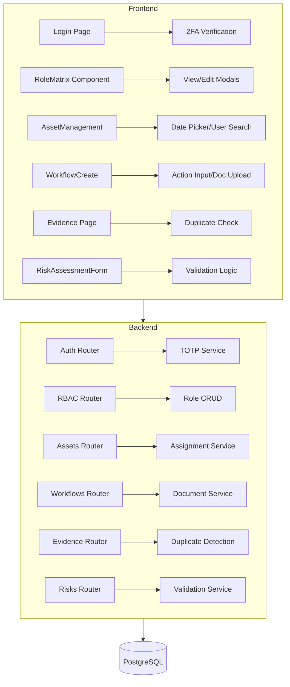

# Design Document

## Overview

This document outlines the technical design for implementing 15 stakeholder-identified fixes across the Galaxy ISO Audit System. The fixes span authentication (2FA), Role Matrix Management, Asset Management, Workflow Management, Audit Evidence Upload, and Risk Assessment modules.

## Architecture

The implementation follows the existing architecture:
- Frontend: Next.js with React components
- Backend: FastAPI with SQLAlchemy ORM
- Database: PostgreSQL via Supabase
- Authentication: JWT-based with optional 2FA enhancement



## Components and Interfaces

### 1. Two-Factor Authentication (2FA)

**Backend Changes:**
- Add `totp_secret` and `totp_enabled` columns to User model
- Create `/auth/2fa/setup` endpoint to generate TOTP secret and QR code
- Create `/auth/2fa/verify` endpoint to validate 2FA codes
- Create `/auth/2fa/backup-codes` endpoint for recovery codes
- Modify `/auth/login` to check 2FA status and require verification

**Frontend Changes:**
- Add 2FA setup component in user settings
- Add 2FA verification step in login flow
- Display backup codes during setup

**Dependencies:** `pyotp`, `qrcode` Python packages

### 2. Role Matrix Edit Form Pre-fill

**Frontend Changes (RoleMatrix.tsx):**
- Modify `handleEditClick` to populate `formData` state with selected role data
- Update edit modal to use pre-filled values

```typescript
const handleEditClick = (role: RoleMatrix) => {
  setFormData({
    role_name: role.role_name,
    role_description: role.role_description || '',
    role_category: role.role_category || 'business',
    is_global_role: role.is_global_role,
    // ... all permission fields
  });
  setSelectedRole(role);
  setShowEditModal(true);
};
```

### 3. Role Matrix View Button

**Frontend Changes (RoleMatrix.tsx):**
- Add `showViewModal` state
- Create read-only view modal component
- Wire view button to display modal with role details

### 4. Asset Warranty Date Picker Enhancement

**Frontend Changes (AssetManagement.tsx):**
- Replace basic date input with enhanced date picker component
- Add month/year navigation controls
- Consider using a library like `react-datepicker` or custom calendar component

### 5. Asset Procurement Date Validation

**Frontend Changes (AssetManagement.tsx):**
```typescript
const validateDates = () => {
  if (formData.procurement_date && formData.warranty_expiry) {
    const procDate = new Date(formData.procurement_date);
    const warrantyDate = new Date(formData.warranty_expiry);
    if (procDate >= warrantyDate) {
      setError('Procurement date must be earlier than warranty expiry date');
      return false;
    }
  }
  return true;
};
```

**Backend Changes (assets.py):**
- Add server-side validation in create/update endpoints

### 6. Asset Assignment Search by Name

**Frontend Changes (AssetManagement.tsx):**
- Replace user ID input with searchable dropdown
- Fetch users list and filter by name
- Display user names with IDs for selection

```typescript
interface UserOption {
  id: string;
  full_name: string;
  department?: string;
}

// Searchable user dropdown component
<Select
  options={users}
  filterOption={(option, inputValue) => 
    option.data.full_name.toLowerCase().includes(inputValue.toLowerCase())
  }
  getOptionLabel={(user) => user.full_name}
  getOptionValue={(user) => user.id}
/>
```

### 7. Workflow Action Required Text Input

**Frontend Changes (workflows/create/page.tsx):**
- Add "custom" option to action_required dropdown
- Show text input when "custom" is selected
- Store custom action text in step data

```typescript
const [steps, setSteps] = useState<WorkflowStepCreate[]>([{
  // ... existing fields
  action_required: 'review_and_approve',
  custom_action_text: '', // New field
}]);
```

**Backend Changes:**
- Add `custom_action_text` column to WorkflowStep model
- Update schemas and API endpoints

### 8. Workflow Document Attachment

**Backend Changes (workflows.py):**
- Add `WorkflowDocument` model for attachments
- Create upload endpoint `/workflows/{id}/documents`
- Store files in Supabase storage

**Frontend Changes:**
- Add file upload section in workflow creation form
- Display attached documents in workflow detail view

```typescript
interface WorkflowDocument {
  id: string;
  workflow_id: string;
  file_name: string;
  file_url: string;
  file_size: number;
  uploaded_by_id: string;
  created_at: string;
}
```

### 9. Audit Evidence Upload Button Label

**Frontend Changes (evidence/page.tsx):**
```typescript
// Change from:
<button>Upload to Supabase</button>

// To:
<button>Upload</button>
```

### 10. Audit Duplicate Evidence Detection

**Backend Changes (evidence.py):**
- Calculate file hash (MD5/SHA256) on upload
- Check for existing files with same hash and name
- Return appropriate response for duplicates

```python
import hashlib

def calculate_file_hash(file_content: bytes) -> str:
    return hashlib.sha256(file_content).hexdigest()

@router.post("/audits/{audit_id}/evidence/upload")
async def upload_evidence(audit_id: UUID, file: UploadFile, ...):
    content = await file.read()
    file_hash = calculate_file_hash(content)
    
    # Check for duplicates
    existing = db.query(Evidence).filter(
        Evidence.audit_id == audit_id,
        Evidence.file_hash == file_hash
    ).first()
    
    if existing:
        raise HTTPException(
            status_code=409,
            detail={"message": "Duplicate file detected", "existing_id": str(existing.id)}
        )
```

**Frontend Changes:**
- Handle 409 response with user-friendly dialog
- Offer replace or cancel options

### 11. Risk Assessment Mandatory Asset

**Frontend Changes (RiskAssessmentForm.tsx):**
```typescript
// Change asset_id field to required
<select
  id="asset_id"
  name="asset_id"
  value={formData.asset_id || ''}
  onChange={handleInputChange}
  required  // Add required attribute
  className="..."
>
  <option value="">Select an asset *</option>
  {assets.map(asset => (...))}
</select>

// Add validation
const handleSubmit = (e: React.FormEvent) => {
  e.preventDefault();
  if (!formData.asset_id) {
    setError('Related asset is required');
    return;
  }
  onSubmit(formData);
};
```

### 12. Remove Related Audit from Risk Assessment

**Frontend Changes (RiskAssessmentForm.tsx):**
- Remove the "Related Audit" dropdown field entirely
- Remove `audit_id` from form state initialization
- Update form layout

### 13. Risk Impact Without Monetary Amount

**Frontend Changes (RiskAssessmentForm.tsx):**
- Modify impact scale display to show qualitative labels only
- Remove financial/monetary references from impact options

```typescript
// Impact options without monetary values
const impactOptions = [
  { value: 1, label: 'Negligible' },
  { value: 2, label: 'Minor' },
  { value: 3, label: 'Moderate' },
  { value: 4, label: 'Major' },
  { value: 5, label: 'Critical' }
];
```

### 14. Risk Assessment Next Review Date Validation

**Frontend Changes (RiskAssessmentForm.tsx):**
```typescript
const validateNextReviewDate = () => {
  if (formData.next_review_date) {
    const reviewDate = new Date(formData.next_review_date);
    const today = new Date();
    today.setHours(0, 0, 0, 0);
    
    if (reviewDate <= today) {
      setError('Next review date must be in the future');
      return false;
    }
  }
  return true;
};

// Also set min attribute on date input
<input
  type="date"
  min={new Date().toISOString().split('T')[0]}
  ...
/>
```

### 15. Workflow Enhancements - Standalone Workflows

**Backend Changes:**
- Make `audit_id` optional in Workflow model and schema
- Add `sender_name`, `sender_department` fields to Workflow
- Add `action_type` enum: CREATE_DOCUMENT, ADD_MINUTES, REVIEW, APPROVE, CUSTOM
- Add `WorkflowDocument` model for custom document uploads

**Frontend Changes (workflows/create/page.tsx):**
- Make audit selection optional
- Add sender information display (auto-populated from current user)
- Add action type dropdown with new options
- Add document upload section

```typescript
const [formData, setFormData] = useState({
  audit_id: '', // Now optional
  name: '',
  description: '',
});

// Action type options
const actionTypes = [
  { value: 'review_and_approve', label: 'Review and Approve' },
  { value: 'create_document', label: 'Create New Document' },
  { value: 'add_minutes', label: 'Add Minutes to Document' },
  { value: 'review', label: 'Review Only' },
  { value: 'acknowledge', label: 'Acknowledge' },
  { value: 'custom', label: 'Custom Action' }
];
```

## Data Models

### New/Modified Models

```python
# User model additions for 2FA
class User(Base):
    # ... existing fields
    totp_secret: str = Column(String, nullable=True)
    totp_enabled: bool = Column(Boolean, default=False)
    backup_codes: str = Column(Text, nullable=True)  # JSON array

# Evidence model additions
class Evidence(Base):
    # ... existing fields
    file_hash: str = Column(String(64), nullable=True)  # SHA256 hash

# WorkflowStep model additions
class WorkflowStep(Base):
    # ... existing fields
    custom_action_text: str = Column(String(500), nullable=True)

# Workflow model modifications
class Workflow(Base):
    # ... existing fields
    audit_id: UUID = Column(UUID, ForeignKey('audits.id'), nullable=True)  # Now optional
    sender_name: str = Column(String(255), nullable=True)
    sender_department: str = Column(String(255), nullable=True)

# New WorkflowDocument model
class WorkflowDocument(Base):
    __tablename__ = 'workflow_documents'
    
    id: UUID = Column(UUID, primary_key=True, default=uuid4)
    workflow_id: UUID = Column(UUID, ForeignKey('workflows.id'), nullable=False)
    file_name: str = Column(String(255), nullable=False)
    file_url: str = Column(String(1000), nullable=False)
    file_size: int = Column(Integer, nullable=False)
    mime_type: str = Column(String(100), nullable=True)
    uploaded_by_id: UUID = Column(UUID, ForeignKey('users.id'), nullable=False)
    created_at: datetime = Column(DateTime, default=datetime.utcnow)
```

## Error Handling

| Scenario | HTTP Status | Error Message |
|----------|-------------|---------------|
| Invalid 2FA code | 401 | "Invalid verification code" |
| 2FA not enabled | 400 | "2FA is not enabled for this account" |
| Duplicate evidence | 409 | "Duplicate file detected" |
| Invalid date range | 400 | "Procurement date must be earlier than warranty expiry" |
| Past review date | 400 | "Next review date must be in the future" |
| Missing required asset | 400 | "Related asset is required" |

## Testing Strategy

### Unit Tests
- 2FA TOTP generation and verification
- Date validation functions
- File hash calculation
- Duplicate detection logic

### Integration Tests
- 2FA login flow end-to-end
- Role matrix CRUD operations with pre-fill
- Asset creation with date validation
- Workflow creation with document attachments
- Evidence upload with duplicate detection
- Risk assessment form validation

### Manual Testing
- UI/UX verification for date pickers
- User search functionality in asset assignment
- Workflow document upload and download
- 2FA setup with authenticator apps (Google Authenticator, Authy)
