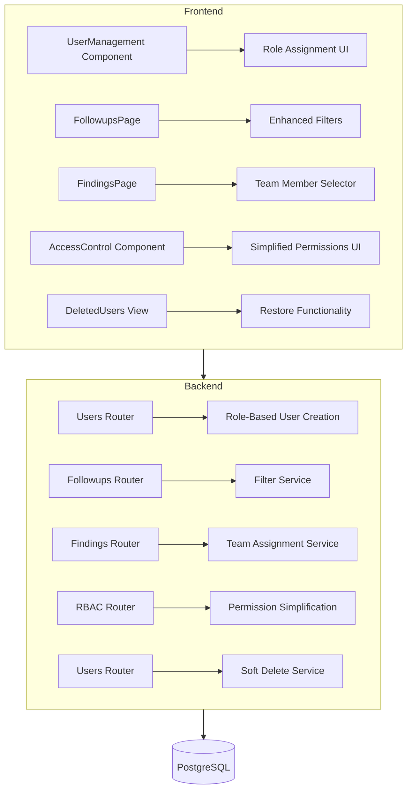

# Design Document

## Overview

This document outlines the technical design for implementing the second batch of stakeholder-identified improvements to the Galaxy ISO Audit System. The enhancements focus on:

1. Enabling managers and department heads to manage users and assign roles
2. Fixing follow-up filtering functionality
3. Allowing flexible finding assignment to any audit team member
4. Simplifying the access control interface
5. Implementing soft delete for user records

The implementation follows the existing architecture with FastAPI backend, Next.js frontend, and PostgreSQL database.

## Architecture



## Components and Interfaces

### 1. Manager and Head of Department User Management

**Backend Changes:**

**Modified Authorization Logic (auth.py):**
```python
# Add new permission check function
def can_manage_users(current_user: User, target_department_id: Optional[UUID] = None) -> bool:
    """
    Check if user can manage other users
    - SYSTEM_ADMIN: Can manage all users
    - AUDIT_MANAGER: Can manage users in their department
    - DEPARTMENT_HEAD: Can manage users in their department
    """
    if current_user.role == UserRole.SYSTEM_ADMIN:
        return True
    
    if current_user.role in [UserRole.AUDIT_MANAGER, UserRole.DEPARTMENT_HEAD]:
        if target_department_id:
            return current_user.department_id == target_department_id
        return True  # Can create users in their department
    
    return False

def get_assignable_roles(current_user: User) -> List[UserRole]:
    """
    Get list of roles that current user can assign
    """
    if current_user.role == UserRole.SYSTEM_ADMIN:
        return list(UserRole)
    
    if current_user.role == UserRole.AUDIT_MANAGER:
        return [
            UserRole.AUDITOR,
            UserRole.DEPARTMENT_OFFICER,
            UserRole.VIEWER
        ]
    
    if current_user.role == UserRole.DEPARTMENT_HEAD:
        return [
            UserRole.DEPARTMENT_OFFICER,
            UserRole.VIEWER
        ]
    
    return []
```

**Modified Users Router (users.py):**
```python
@router.post("/", response_model=UserResponse)
def create_user(
    user_data: UserCreate,
    db: Session = Depends(get_db),
    current_user: User = Depends(get_current_user)
):
    # Check if user has permission to create users
    if not can_manage_users(current_user, user_data.department_id):
        raise HTTPException(
            status_code=403, 
            detail="Not authorized to create users in this department"
        )
    
    # Validate role assignment
    assignable_roles = get_assignable_roles(current_user)
    if user_data.role not in assignable_roles:
        raise HTTPException(
            status_code=403,
            detail=f"Not authorized to assign role: {user_data.role}"
        )
    
    # For non-admins, enforce department constraint
    if current_user.role != UserRole.SYSTEM_ADMIN:
        if not user_data.department_id:
            user_data.department_id = current_user.department_id
        elif user_data.department_id != current_user.department_id:
            raise HTTPException(
                status_code=403,
                detail="Can only create users in your own department"
            )
    
    existing = db.query(User).filter(User.email == user_data.email).first()
    if existing:
        raise HTTPException(status_code=400, detail="Email already exists")
    
    new_user = User(**user_data.model_dump())
    db.add(new_user)
    db.commit()
    db.refresh(new_user)
    return new_user

@router.get("/assignable-roles", response_model=List[str])
def get_user_assignable_roles(
    current_user: User = Depends(get_current_user)
):
    """Get list of roles current user can assign"""
    return [role.value for role in get_assignable_roles(current_user)]
```

**Frontend Changes (UserManagement.tsx):**
```typescript
// Add state for assignable roles
const [assignableRoles, setAssignableRoles] = useState<string[]>([]);

// Load assignable roles on mount
useEffect(() => {
  loadAssignableRoles();
}, []);

const loadAssignableRoles = async () => {
  try {
    const response = await api.get('/users/assignable-roles');
    setAssignableRoles(response.data);
  } catch (err) {
    console.error('Error loading assignable roles:', err);
  }
};

// Filter role options based on assignable roles
const availableRoles = userRoles.filter(role => 
  assignableRoles.includes(role.value)
);

// Show create user button for managers and department heads
const canCreateUsers = ['system_admin', 'audit_manager', 'department_head']
  .includes(currentUser?.role || '');
```

### 2. Follow-Up Filter Functionality

**Backend Changes (followups.py):**
```python
@router.get("/my-followups", response_model=List[FollowupResponse])
def get_my_followups(
    status: Optional[str] = Query(None, description="Filter by status"),
    overdue_only: Optional[bool] = Query(False, description="Show only overdue items"),
    assigned_to_id: Optional[UUID] = Query(None, description="Filter by assignee"),
    start_date: Optional[datetime] = Query(None, description="Filter by start date"),
    end_date: Optional[datetime] = Query(None, description="Filter by end date"),
    audit_id: Optional[UUID] = Query(None, description="Filter by audit"),
    sort_by: Optional[str] = Query("due_date", description="Sort field"),
    sort_order: Optional[str] = Query("asc", description="Sort order: asc or desc"),
    db: Session = Depends(get_db),
    current_user: User = Depends(get_current_user)
):
    """
    Get follow-ups with comprehensive filtering
    Requirements: 2.1, 2.2, 2.3, 2.4, 2.5
    """
    # Base query
    query = db.query(AuditFollowup)
    
    # Apply filters based on user role
    if current_user.role not in [UserRole.SYSTEM_ADMIN, UserRole.AUDIT_MANAGER]:
        # Regular users see only their assigned follow-ups
        query = query.filter(AuditFollowup.assigned_to_id == current_user.id)
    
    # Status filter
    if status:
        query = query.filter(AuditFollowup.status == status)
    
    # Overdue filter
    if overdue_only:
        query = query.filter(
            and_(
                AuditFollowup.due_date < datetime.utcnow(),
                AuditFollowup.status.notin_(['completed', 'closed'])
            )
        )
    
    # Assignee filter (for managers/admins)
    if assigned_to_id and current_user.role in [UserRole.SYSTEM_ADMIN, UserRole.AUDIT_MANAGER]:
        query = query.filter(AuditFollowup.assigned_to_id == assigned_to_id)
    
    # Date range filter
    if start_date:
        query = query.filter(AuditFollowup.due_date >= start_date)
    if end_date:
        query = query.filter(AuditFollowup.due_date <= end_date)
    
    # Audit filter
    if audit_id:
        query = query.filter(AuditFollowup.audit_id == audit_id)
    
    # Sorting
    sort_column = getattr(AuditFollowup, sort_by, AuditFollowup.due_date)
    if sort_order == 'desc':
        query = query.order_by(desc(sort_column))
    else:
        query = query.order_by(asc(sort_column))
    
    followups = query.all()
    return followups
```

**Frontend Changes (followups/page.tsx):**
```typescript
// Enhanced filter state
const [filters, setFilters] = useState({
  status: '',
  assignee: '',
  auditId: '',
  startDate: '',
  endDate: '',
  overdueOnly: false
});

// Fetch users for assignee filter
const { data: users = [] } = useQuery<User[]>({
  queryKey: ['users'],
  queryFn: async () => {
    const response = await api.get('/users/');
    return response.data;
  }
});

// Fetch audits for audit filter
const { data: audits = [] } = useQuery<Audit[]>({
  queryKey: ['audits'],
  queryFn: async () => {
    const response = await api.get('/audits/');
    return response.data;
  }
});

// Updated query with all filters
const { data: followups = [], isLoading } = useQuery<Followup[]>({
  queryKey: ['my-followups', filters, sortBy, sortOrder],
  queryFn: async () => {
    const params = new URLSearchParams();
    if (filters.status) params.append('status', filters.status);
    if (filters.assignee) params.append('assigned_to_id', filters.assignee);
    if (filters.auditId) params.append('audit_id', filters.auditId);
    if (filters.startDate) params.append('start_date', filters.startDate);
    if (filters.endDate) params.append('end_date', filters.endDate);
    if (filters.overdueOnly) params.append('overdue_only', 'true');
    params.append('sort_by', sortBy);
    params.append('sort_order', sortOrder);
    
    const response = await api.get(`/followups/my-followups?${params.toString()}`);
    return response.data;
  }
});

// Clear filters function
const clearFilters = () => {
  setFilters({
    status: '',
    assignee: '',
    auditId: '',
    startDate: '',
    endDate: '',
    overdueOnly: false
  });
};

// Filter UI component
<div className="grid grid-cols-1 md:grid-cols-3 lg:grid-cols-5 gap-4 mb-6">
  <Select value={filters.status} onValueChange={(value) => setFilters({...filters, status: value})}>
    <SelectTrigger>
      <SelectValue placeholder="Filter by status" />
    </SelectTrigger>
    <SelectContent>
      <SelectItem value="">All Statuses</SelectItem>
      <SelectItem value="pending">Pending</SelectItem>
      <SelectItem value="in_progress">In Progress</SelectItem>
      <SelectItem value="completed">Completed</SelectItem>
      <SelectItem value="closed">Closed</SelectItem>
    </SelectContent>
  </Select>

  <Select value={filters.assignee} onValueChange={(value) => setFilters({...filters, assignee: value})}>
    <SelectTrigger>
      <SelectValue placeholder="Filter by assignee" />
    </SelectTrigger>
    <SelectContent>
      <SelectItem value="">All Assignees</SelectItem>
      {users.map(user => (
        <SelectItem key={user.id} value={user.id}>{user.full_name}</SelectItem>
      ))}
    </SelectContent>
  </Select>

  <Input
    type="date"
    placeholder="Start date"
    value={filters.startDate}
    onChange={(e) => setFilters({...filters, startDate: e.target.value})}
  />

  <Input
    type="date"
    placeholder="End date"
    value={filters.endDate}
    onChange={(e) => setFilters({...filters, endDate: e.target.value})}
  />

  <Button onClick={clearFilters} variant="outline">Clear Filters</Button>
</div>
```

### 3. Flexible Finding Assignment

**Backend Changes:**

**New endpoint in audits.py:**
```python
@router.get("/{audit_id}/team-members", response_model=List[UserResponse])
def get_audit_team_members(
    audit_id: UUID,
    db: Session = Depends(get_db),
    current_user: User = Depends(get_current_user)
):
    """
    Get all team members assigned to an audit
    Requirements: 3.1
    """
    audit = db.query(Audit).filter(Audit.id == audit_id).first()
    if not audit:
        raise HTTPException(status_code=404, detail="Audit not found")
    
    # Get all team members from AuditTeam table
    team_members = db.query(User).join(
        AuditTeam, AuditTeam.user_id == User.id
    ).filter(
        AuditTeam.audit_id == audit_id,
        AuditTeam.is_active == True
    ).all()
    
    return team_members
```

**Modified findings endpoint:**
```python
@router.post("/audits/{audit_id}/findings", response_model=FindingResponse)
def create_finding(
    audit_id: UUID,
    finding_data: FindingCreate,
    db: Session = Depends(get_db),
    current_user: User = Depends(get_current_user)
):
    """
    Create a new finding with flexible team member assignment
    Requirements: 3.1, 3.2, 3.3
    """
    audit = db.query(Audit).filter(Audit.id == audit_id).first()
    if not audit:
        raise HTTPException(status_code=404, detail="Audit not found")
    
    # Validate assignee is a team member
    if finding_data.assigned_to_id:
        is_team_member = db.query(AuditTeam).filter(
            AuditTeam.audit_id == audit_id,
            AuditTeam.user_id == finding_data.assigned_to_id,
            AuditTeam.is_active == True
        ).first()
        
        if not is_team_member:
            raise HTTPException(
                status_code=400,
                detail="Assignee must be a member of the audit team"
            )
    
    new_finding = AuditFinding(
        audit_id=audit_id,
        **finding_data.model_dump()
    )
    
    db.add(new_finding)
    db.commit()
    db.refresh(new_finding)
    
    # Send notification to assignee
    if finding_data.assigned_to_id:
        # TODO: Implement notification service
        pass
    
    return new_finding
```

**Frontend Changes (findings page):**
```typescript
// Fetch audit team members
const { data: teamMembers = [] } = useQuery<User[]>({
  queryKey: ['audit-team-members', auditId],
  queryFn: async () => {
    const response = await api.get(`/audits/${auditId}/team-members`);
    return response.data;
  },
  enabled: !!auditId
});

// Finding assignment component
<Select
  value={formData.assigned_to_id || ''}
  onValueChange={(value) => setFormData({...formData, assigned_to_id: value})}
>
  <SelectTrigger>
    <SelectValue placeholder="Assign to team member" />
  </SelectTrigger>
  <SelectContent>
    <SelectItem value="">Unassigned</SelectItem>
    {teamMembers.map(member => (
      <SelectItem key={member.id} value={member.id}>
        {member.full_name} - {member.role}
      </SelectItem>
    ))}
  </SelectContent>
</Select>

// Display assigned member in findings list
<div className="flex items-center gap-2">
  <User className="w-4 h-4" />
  <span>{finding.assigned_to?.full_name || 'Unassigned'}</span>
</div>
```

### 4. Simplified Access Control

**Backend Changes (rbac.py):**
```python
# New simplified permission groups
PERMISSION_GROUPS = {
    "audit_management": {
        "label": "Audit Management",
        "description": "Create, view, and manage audits",
        "permissions": [
            "can_create_audits",
            "can_view_audits",
            "can_edit_audits",
            "can_delete_audits"
        ]
    },
    "findings_and_followups": {
        "label": "Findings & Follow-ups",
        "description": "Manage audit findings and follow-up actions",
        "permissions": [
            "can_create_findings",
            "can_assign_findings",
            "can_manage_followups"
        ]
    },
    "risk_management": {
        "label": "Risk Management",
        "description": "Assess and manage organizational risks",
        "permissions": [
            "can_create_risks",
            "can_assess_risks",
            "can_approve_risk_treatments"
        ]
    },
    "capa_management": {
        "label": "CAPA Management",
        "description": "Create and manage corrective actions",
        "permissions": [
            "can_create_capa",
            "can_assign_capa",
            "can_close_capa"
        ]
    },
    "document_management": {
        "label": "Document Management",
        "description": "Upload, approve, and manage documents",
        "permissions": [
            "can_upload_documents",
            "can_approve_documents",
            "can_archive_documents"
        ]
    },
    "reporting_and_analytics": {
        "label": "Reporting & Analytics",
        "description": "View reports and analytics dashboards",
        "permissions": [
            "can_view_analytics",
            "can_export_data",
            "can_approve_reports"
        ]
    },
    "user_management": {
        "label": "User Management",
        "description": "Manage users and departments",
        "permissions": [
            "can_manage_users",
            "can_manage_departments"
        ]
    }
}

@router.get("/permission-groups")
def get_permission_groups(
    current_user: User = Depends(get_current_user)
):
    """
    Get simplified permission groups for UI
    Requirements: 4.1, 4.2, 4.3
    """
    return PERMISSION_GROUPS

@router.get("/role-templates")
def get_role_templates(
    current_user: User = Depends(get_current_user)
):
    """
    Get predefined role templates for quick assignment
    Requirements: 4.5
    """
    templates = {
        "auditor_standard": {
            "name": "Standard Auditor",
            "description": "Can conduct audits and create findings",
            "permission_groups": ["audit_management", "findings_and_followups", "document_management"]
        },
        "risk_assessor": {
            "name": "Risk Assessor",
            "description": "Can assess and manage risks",
            "permission_groups": ["risk_management", "reporting_and_analytics"]
        },
        "department_manager": {
            "name": "Department Manager",
            "description": "Can manage department audits and users",
            "permission_groups": ["audit_management", "findings_and_followups", "reporting_and_analytics"]
        }
    }
    return templates
```

**Frontend Changes (AccessControl.tsx):**
```typescript
// Simplified permission groups UI
interface PermissionGroup {
  label: string;
  description: string;
  permissions: string[];
}

const [permissionGroups, setPermissionGroups] = useState<Record<string, PermissionGroup>>({});
const [selectedGroups, setSelectedGroups] = useState<string[]>([]);

// Load permission groups
useEffect(() => {
  loadPermissionGroups();
}, []);

const loadPermissionGroups = async () => {
  try {
    const response = await rbacApi.getPermissionGroups();
    setPermissionGroups(response.data);
  } catch (err) {
    console.error('Error loading permission groups:', err);
  }
};

// Simplified UI with grouped permissions
<div className="space-y-4">
  <h3 className="text-lg font-semibold">Assign Permissions</h3>
  <p className="text-sm text-gray-600">
    Select functional areas to grant access. Hover over each area for details.
  </p>
  
  <div className="grid grid-cols-1 md:grid-cols-2 gap-4">
    {Object.entries(permissionGroups).map(([key, group]) => (
      <Card key={key} className="cursor-pointer hover:border-blue-500">
        <CardContent className="p-4">
          <div className="flex items-start gap-3">
            <input
              type="checkbox"
              checked={selectedGroups.includes(key)}
              onChange={(e) => {
                if (e.target.checked) {
                  setSelectedGroups([...selectedGroups, key]);
                } else {
                  setSelectedGroups(selectedGroups.filter(g => g !== key));
                }
              }}
              className="mt-1"
            />
            <div>
              <h4 className="font-medium">{group.label}</h4>
              <p className="text-sm text-gray-600">{group.description}</p>
            </div>
          </div>
        </CardContent>
      </Card>
    ))}
  </div>
  
  {/* Quick role templates */}
  <div className="mt-6">
    <h4 className="text-md font-semibold mb-2">Quick Templates</h4>
    <div className="flex gap-2">
      <Button variant="outline" onClick={() => applyTemplate('auditor_standard')}>
        Standard Auditor
      </Button>
      <Button variant="outline" onClick={() => applyTemplate('risk_assessor')}>
        Risk Assessor
      </Button>
      <Button variant="outline" onClick={() => applyTemplate('department_manager')}>
        Department Manager
      </Button>
    </div>
  </div>
</div>
```

### 5. Soft Delete for User Records

**Backend Changes:**

**Modified User Model (models.py):**
```python
class User(Base):
    __tablename__ = "users"
    
    id = Column(UUID(as_uuid=True), primary_key=True, default=uuid.uuid4)
    email = Column(String, unique=True, nullable=False, index=True)
    full_name = Column(String, nullable=False)
    role = Column(Enum(UserRole), nullable=False)
    department_id = Column(UUID(as_uuid=True), ForeignKey("departments.id"))
    is_active = Column(Boolean, default=True)
    created_at = Column(DateTime, default=datetime.utcnow)
    
    # Soft delete fields
    is_deleted = Column(Boolean, default=False, index=True)
    deleted_at = Column(DateTime, nullable=True)
    deleted_by_id = Column(UUID(as_uuid=True), ForeignKey("users.id"), nullable=True)
    deletion_reason = Column(Text, nullable=True)
    
    # 2FA fields
    totp_secret = Column(String(32), nullable=True)
    totp_enabled = Column(Boolean, default=False)
    backup_codes = Column(Text, nullable=True)
    
    department = relationship("Department", back_populates="users")
    deleted_by = relationship("User", remote_side=[id], foreign_keys=[deleted_by_id])
```

**Database Migration:**
```python
# Alembic migration
def upgrade():
    op.add_column('users', sa.Column('is_deleted', sa.Boolean(), nullable=False, server_default='false'))
    op.add_column('users', sa.Column('deleted_at', sa.DateTime(), nullable=True))
    op.add_column('users', sa.Column('deleted_by_id', sa.UUID(), nullable=True))
    op.add_column('users', sa.Column('deletion_reason', sa.Text(), nullable=True))
    
    op.create_index('ix_users_is_deleted', 'users', ['is_deleted'])
    op.create_foreign_key('fk_users_deleted_by', 'users', 'users', ['deleted_by_id'], ['id'])

def downgrade():
    op.drop_constraint('fk_users_deleted_by', 'users', type_='foreignkey')
    op.drop_index('ix_users_is_deleted', 'users')
    op.drop_column('users', 'deletion_reason')
    op.drop_column('users', 'deleted_by_id')
    op.drop_column('users', 'deleted_at')
    op.drop_column('users', 'is_deleted')
```

**Modified Users Router (users.py):**
```python
@router.get("/", response_model=List[UserResponse])
def list_users(
    include_deleted: bool = Query(False, description="Include soft-deleted users"),
    db: Session = Depends(get_db),
    current_user: User = Depends(get_current_user)
):
    """
    List users, excluding soft-deleted by default
    Requirements: 5.4
    """
    query = db.query(User)
    
    if not include_deleted:
        query = query.filter(User.is_deleted == False)
    
    users = query.all()
    return users

@router.get("/deleted", response_model=List[UserResponse])
def list_deleted_users(
    db: Session = Depends(get_db),
    current_user: User = Depends(require_roles([UserRole.SYSTEM_ADMIN]))
):
    """
    List all soft-deleted users (admin only)
    Requirements: 5.5
    """
    deleted_users = db.query(User).filter(User.is_deleted == True).all()
    return deleted_users

@router.delete("/{user_id}")
def soft_delete_user(
    user_id: UUID,
    deletion_reason: Optional[str] = Query(None, description="Reason for deletion"),
    db: Session = Depends(get_db),
    current_user: User = Depends(require_roles([UserRole.SYSTEM_ADMIN]))
):
    """
    Soft delete a user (mark as deleted without removing from database)
    Requirements: 5.1, 5.2, 5.3
    """
    user = db.query(User).filter(User.id == user_id).first()
    if not user:
        raise HTTPException(status_code=404, detail="User not found")
    
    if user.is_deleted:
        raise HTTPException(status_code=400, detail="User is already deleted")
    
    # Prevent self-deletion
    if user.id == current_user.id:
        raise HTTPException(status_code=400, detail="Cannot delete your own account")
    
    # Soft delete
    user.is_deleted = True
    user.deleted_at = datetime.utcnow()
    user.deleted_by_id = current_user.id
    user.deletion_reason = deletion_reason
    user.is_active = False  # Also deactivate to prevent login
    
    db.commit()
    
    return {
        "success": True,
        "message": f"User {user.full_name} has been soft deleted",
        "deleted_at": user.deleted_at
    }

@router.post("/{user_id}/restore")
def restore_user(
    user_id: UUID,
    db: Session = Depends(get_db),
    current_user: User = Depends(require_roles([UserRole.SYSTEM_ADMIN]))
):
    """
    Restore a soft-deleted user
    Requirements: 5.6
    """
    user = db.query(User).filter(User.id == user_id).first()
    if not user:
        raise HTTPException(status_code=404, detail="User not found")
    
    if not user.is_deleted:
        raise HTTPException(status_code=400, detail="User is not deleted")
    
    # Restore user
    user.is_deleted = False
    user.deleted_at = None
    user.deleted_by_id = None
    user.deletion_reason = None
    user.is_active = True  # Reactivate account
    
    db.commit()
    db.refresh(user)
    
    return {
        "success": True,
        "message": f"User {user.full_name} has been restored",
        "user": user
    }
```

**Modified Authentication (auth.py):**
```python
def get_current_user(token: str = Depends(oauth2_scheme), db: Session = Depends(get_db)) -> User:
    """
    Get current user from JWT token
    Prevent login for soft-deleted users
    Requirements: 5.3
    """
    credentials_exception = HTTPException(
        status_code=status.HTTP_401_UNAUTHORIZED,
        detail="Could not validate credentials",
        headers={"WWW-Authenticate": "Bearer"},
    )
    
    try:
        payload = jwt.decode(token, SECRET_KEY, algorithms=[ALGORITHM])
        user_id: str = payload.get("sub")
        if user_id is None:
            raise credentials_exception
    except JWTError:
        raise credentials_exception
    
    user = db.query(User).filter(User.id == user_id).first()
    if user is None:
        raise credentials_exception
    
    # Check if user is soft-deleted
    if user.is_deleted:
        raise HTTPException(
            status_code=status.HTTP_403_FORBIDDEN,
            detail="This account has been deactivated. Please contact your administrator."
        )
    
    if not user.is_active:
        raise HTTPException(
            status_code=status.HTTP_403_FORBIDDEN,
            detail="This account is inactive"
        )
    
    return user
```

**Frontend Changes:**

**New DeletedUsers Component:**
```typescript
'use client';

import React, { useState } from 'react';
import { useQuery, useMutation, useQueryClient } from '@tanstack/react-query';
import { api } from '@/lib/api';
import { Card, CardContent, CardHeader, CardTitle } from '@/components/ui/card';
import { Button } from '@/components/ui/button';
import { Badge } from '@/components/ui/badge';
import { Alert, AlertDescription } from '@/components/ui/alert';
import { Trash2, RotateCcw, User, Calendar } from 'lucide-react';

interface DeletedUser {
  id: string;
  full_name: string;
  email: string;
  role: string;
  department_id?: string;
  deleted_at: string;
  deleted_by_id?: string;
  deletion_reason?: string;
}

export default function DeletedUsersView() {
  const queryClient = useQueryClient();
  const [selectedUser, setSelectedUser] = useState<DeletedUser | null>(null);

  // Fetch deleted users
  const { data: deletedUsers = [], isLoading } = useQuery<DeletedUser[]>({
    queryKey: ['deleted-users'],
    queryFn: async () => {
      const response = await api.get('/users/deleted');
      return response.data;
    }
  });

  // Restore user mutation
  const restoreMutation = useMutation({
    mutationFn: async (userId: string) => {
      const response = await api.post(`/users/${userId}/restore`);
      return response.data;
    },
    onSuccess: () => {
      queryClient.invalidateQueries({ queryKey: ['deleted-users'] });
      queryClient.invalidateQueries({ queryKey: ['users'] });
      setSelectedUser(null);
    }
  });

  const formatDate = (dateString: string) => {
    return new Date(dateString).toLocaleDateString('en-US', {
      year: 'numeric',
      month: 'short',
      day: 'numeric',
      hour: '2-digit',
      minute: '2-digit'
    });
  };

  return (
    <div className="p-8">
      <div className="flex justify-between items-center mb-6">
        <h1 className="text-3xl font-bold">Deleted Users</h1>
        <Badge variant="outline">{deletedUsers.length} deleted users</Badge>
      </div>

      {deletedUsers.length === 0 ? (
        <Alert>
          <AlertDescription>No deleted users found.</AlertDescription>
        </Alert>
      ) : (
        <div className="grid gap-4">
          {deletedUsers.map(user => (
            <Card key={user.id}>
              <CardContent className="p-6">
                <div className="flex items-center justify-between">
                  <div className="flex items-center gap-4">
                    <User className="w-10 h-10 text-gray-400" />
                    <div>
                      <h3 className="font-semibold">{user.full_name}</h3>
                      <p className="text-sm text-gray-600">{user.email}</p>
                      <div className="flex items-center gap-2 mt-1">
                        <Badge>{user.role}</Badge>
                        <span className="text-xs text-gray-500 flex items-center gap-1">
                          <Calendar className="w-3 h-3" />
                          Deleted: {formatDate(user.deleted_at)}
                        </span>
                      </div>
                      {user.deletion_reason && (
                        <p className="text-sm text-gray-600 mt-2">
                          Reason: {user.deletion_reason}
                        </p>
                      )}
                    </div>
                  </div>
                  <Button
                    onClick={() => restoreMutation.mutate(user.id)}
                    disabled={restoreMutation.isPending}
                    variant="outline"
                  >
                    <RotateCcw className="w-4 h-4 mr-2" />
                    Restore User
                  </Button>
                </div>
              </CardContent>
            </Card>
          ))}
        </div>
      )}
    </div>
  );
}
```

**Modified UserManagement Component:**
```typescript
// Add soft delete with reason
const [deleteReason, setDeleteReason] = useState('');
const [showDeleteDialog, setShowDeleteDialog] = useState(false);
const [userToDelete, setUserToDelete] = useState<User | null>(null);

const deleteMutation = useMutation({
  mutationFn: async ({ userId, reason }: { userId: string; reason?: string }) => {
    const params = reason ? `?deletion_reason=${encodeURIComponent(reason)}` : '';
    const response = await api.delete(`/users/${userId}${params}`);
    return response.data;
  },
  onSuccess: () => {
    queryClient.invalidateQueries({ queryKey: ['users'] });
    setShowDeleteDialog(false);
    setUserToDelete(null);
    setDeleteReason('');
  }
});

// Delete dialog
{showDeleteDialog && userToDelete && (
  <div className="fixed inset-0 bg-black bg-opacity-50 flex items-center justify-center z-50">
    <Card className="w-full max-w-md">
      <CardHeader>
        <CardTitle>Delete User</CardTitle>
      </CardHeader>
      <CardContent>
        <p className="mb-4">
          Are you sure you want to delete {userToDelete.full_name}? 
          This user will be moved to deleted records and can be restored later.
        </p>
        <div className="mb-4">
          <label className="block text-sm font-medium mb-2">
            Reason for deletion (optional)
          </label>
          <Input
            value={deleteReason}
            onChange={(e) => setDeleteReason(e.target.value)}
            placeholder="Enter reason..."
          />
        </div>
        <div className="flex gap-2">
          <Button
            onClick={() => deleteMutation.mutate({ 
              userId: userToDelete.id, 
              reason: deleteReason 
            })}
            disabled={deleteMutation.isPending}
            variant="destructive"
          >
            Delete User
          </Button>
          <Button
            onClick={() => {
              setShowDeleteDialog(false);
              setUserToDelete(null);
              setDeleteReason('');
            }}
            variant="outline"
          >
            Cancel
          </Button>
        </div>
      </CardContent>
    </Card>
  </div>
)}

// Add link to view deleted users
<Button 
  onClick={() => router.push('/users/deleted')}
  variant="outline"
>
  <Trash2 className="w-4 h-4 mr-2" />
  View Deleted Users
</Button>
```

## Data Models

### Modified Models

**User Model Additions:**
```python
class User(Base):
    # ... existing fields
    
    # Soft delete fields
    is_deleted = Column(Boolean, default=False, index=True)
    deleted_at = Column(DateTime, nullable=True)
    deleted_by_id = Column(UUID(as_uuid=True), ForeignKey("users.id"), nullable=True)
    deletion_reason = Column(Text, nullable=True)
    
    deleted_by = relationship("User", remote_side=[id], foreign_keys=[deleted_by_id])
```

### Schema Updates

**UserResponse Schema:**
```python
class UserResponse(BaseModel):
    id: UUID
    email: str
    full_name: str
    role: UserRole
    department_id: Optional[UUID]
    is_active: bool
    created_at: datetime
    
    # Soft delete fields (only visible to admins)
    is_deleted: Optional[bool] = None
    deleted_at: Optional[datetime] = None
    deleted_by_id: Optional[UUID] = None
    deletion_reason: Optional[str] = None
    
    class Config:
        from_attributes = True
```

## Error Handling

| Scenario | HTTP Status | Error Message |
|----------|-------------|---------------|
| Unauthorized user creation | 403 | "Not authorized to create users in this department" |
| Invalid role assignment | 403 | "Not authorized to assign role: {role}" |
| User already deleted | 400 | "User is already deleted" |
| Self-deletion attempt | 400 | "Cannot delete your own account" |
| Deleted user login attempt | 403 | "This account has been deactivated. Please contact your administrator." |
| Assignee not on audit team | 400 | "Assignee must be a member of the audit team" |
| User not deleted (restore) | 400 | "User is not deleted" |

## Testing Strategy

### Unit Tests
- User creation permission validation
- Role assignment authorization logic
- Soft delete and restore operations
- Filter query building for follow-ups
- Team member validation for finding assignment

### Integration Tests
- Manager creating users in their department
- Department head assigning roles
- Follow-up filtering with multiple criteria
- Finding assignment to audit team members
- Soft delete preventing login
- User restoration flow

### Manual Testing
- UI/UX verification for simplified access control
- Permission group selection workflow
- Deleted users view and restore functionality
- Filter combinations in follow-ups page
- Team member dropdown in findings assignment
